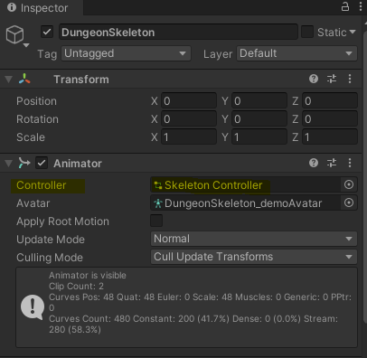

# ✍️ 절차적 애니메이션이란?

대부분의 게임에서 캐릭터 애니메이션은 정적이다. 캐릭터가 움직일 때 필요한 동작은 아티스트들이 사전에 만들어놓은 애니메이션을 재생하는 것으로 다른 움직임이 필요하다면 그에 걸맞은 애니메이션을 만들어낸다. 

그런데 게임 개발을 하다 보면 한 오브젝트가 다른 오브젝트와 상호작용을 해야 할 때가 있다. 여기서 말하는 상호작용이란 단순히 애니메이션을 재생하는 것이 아니라 아래의 영상과 같이 주변 오브젝트에 따라 캐릭터의 움직임이 영향을 받는 것이다.

예를 들면, 어떤 물체의 움직임에 따라 캐릭터의 시선이 따라간다든지 무기를 잡는 동작이 다르다든지 등 주변 환경에 맞는 상호작용이 필요한 경우가 무수히 많다. 이러한 모든 경우의 수를 계산해서 애니메이션을 미리 만들어 놓을 순 있지만 게임의 규모가 커지고 자유도가 높은 게임이라면 좋은 접근법은 아닌듯하다.

그리하여 등장한 개념이 바로 절차적 애니메이션(Procedural animation)으로 다양한 동작을 위해 실시간으로 애니메이션을 자동 생성하는 것이다. 쉬운 작업은 아니지만 유니티에선 애니메이션 리깅(Animation Rigging)이라는 기능을 도입해 보다 쉽게 구현하도록 도움을 주고 있다.

# 🍊 애니메이션 리깅(Animation Rigging)

[스켈레톤 다운로드](https://assetstore.unity.com/packages/3d/characters/creatures/dungeon-skeletons-demo-71087?aid=1101lPGj&utm_campaign=unity_affiliate&utm_medium=affiliate&utm_source=partnerize-linkmaker)

먼저 스켈레톤을 다운 받고 임포트 해서 씬에 배치해 보자.

Hierarchy 창에서 던전 스켈레톤의 자식 오브젝트 중 Bip001은 캐릭터의 뼈대로 릭(Rig)이라고 불리며 릭은 캐릭터의 개별 뼈를 구성하는 오브젝트의 계층구조를 가진다. 

Thigh(대퇴골)를 클릭하면 던전 스켈레톤의 대퇴골이 포커싱 된다.

애니메이션 리깅을 알아보기 전에 캐릭터 애니메이션은 기본적으로 3단계로 작동하는데 

1\. 캐릭터는 애니메이터에 의해 결정된 애니메이션을 재생한다.

2\. 해당 애니메이션에 의해 뼈대가 이동한다.

3\. 캐릭터의 메시는 스킨 메시 렌더러를 통해 뼈대를 따라 이동하게 된다. 

앞서 말했듯 미리 제작된 애니메이션은 정적이며 다채로운 상황에서 완벽하게 동작하지 않는다. 하물며 상호작용을 위한 캐릭터의 움직임이 어디서 부터 시작해서 어디서 끝날지 미리 알지 못한다.

예를 들어 캐릭터가 한 오브젝트를 바라봐야 한다면 게임이 실행되는 동안 오브젝트의 움직임에 따라 캐릭터의 머리가 따라 움직여야 한다. 그러나 애니메이션은 이미 머리에 대한 움직임을 정의하고 있기에 상호작용은 불가능하다.

이러한 문제를 해결하기 위한 방법이 바로 애니메이션 리깅이다!

# 🖥️ 애니메이션 리깅 실습

먼저 Unity에 Animation Rigging 패키지를 설치해야 한다.

Windows - Package Manager에서 Animation Rigging 패키지를 검색하고 Install 한다.

패키지 설치가 끝났으면 애니메이션 리깅을 설정해서 캐릭터를 구성하는 뼈대를 나타내는 것으로 시작한다.

던전 스켈레톤을 누르고 상단에 Animation Rigging - Bone Renderer Setup을 클릭하면 된다.

Bone Renderer Setup를 클릭하면 던전 스켈레톤에 Bone Renderer라는 컴포넌트가 추가되며 동시에 Scene 뷰에 던전 스켈레톤의 뼈대가 표시되고 마우스로 쉽게 클릭도 가능해진다!

Bone Renderer는 던전 스켈레톤의 릭을 구성하는 뼈대 오브젝트들의 트랜스폼을 참조하고 있으며 뼈대의 크기나 색을 조정할 수도 있다.

여기까지 됐다면 Rig을 만들어야 한다. 참고로 애니메이션 리깅은 별도의 Rig을 만듦으로써 동작한다.

던전 스켈레톤을 클릭하고 상단의 Animation Rigging - Rig Setup을 클릭하면 두 가지 변화가 생긴다.

1.  던전 스켈레톤에 Rig Layer를 가진 Rig Builer 컴포넌트가 추가된다.  

2.  던전 스켈레톤의 자식으로 Rig 컴포넌트를 가진 한 오브젝트가 생긴다.

Rig 1 오브젝트에 제약조건(Constraint)를 추가함으로써 애니메이션 리깅이 가능해진다.

Rig 1에 Empty 오브젝트를 하나 추가해서 이름을 HeadAim으로 변경하고 HeadAim에 Multi-Aim Constraint 컴포넌트를 추가해 보자. 

Multi-Aim Constraint에 몇 가지 정보를 넘겨줘야 한다.

1.  Constrained Object에 제약조건이 걸릴 뼈대를 넘겨주면 되는데, 본 실습에선 머리에 애니메이션 리깅을 적용하고 싶으니 Constrained Object에 던전 스켈레톤의 Head 뼈대를 넘겨주고 Aim Axis를 Y로 변경해 주자.  
    
2.  Source Object는 Constrained Object와 상호작용할 오브젝트로 HeadAim 산하에 Empty Object를 하나 추가해서 Target이라는 이름으로 변경하고 Source Object에 넘겨주자.  
    
3.  Scene에서 Target이 안 보이니 Shape을 BallEffector로 변경해 주자.  
    
4.  마지막으로 Multi-Aim Constraint에 Setting을 살펴보면 뼈대가 회전할 수 있는 최솟값과 최댓값을 지정해 줄 수 있다. Min Limit과 Max Limit을 각각 -100, 100으로 지정하면 멋진 결과물이 탄생한다.

추가로 Rig 컴포넌트에 weight가 있다. 이는 타겟이 캐릭터에게 영향을 주는 정도로 weight가 줄어들수록 target과 상호작용은 약해진다. 

머리만 움직이면 어색하니 흉부도 함께 움직이도록 Constrained Object를 하나 더 추가하고 머리와 흉부에 weight 값을 다르게 줘서 자연스러운 애니메이션을 연출해 보자.

흉부도 함께 움직인다.

# 📝 정리

우리는 Rig을 이용해서 폭발물이 터졌을 때와 같은 중요한 이벤트가 발생하면 캐릭터가 해당 지점을 응시하는 등 다양한 실시간 애니메이션을 적용할 수 있다!!

# ✍️ Two Bone IK Constraint

다양한 동작들을 유도할 수 있는 서로 다른 제약조건(Constraints)이 있다.

파트 1에서 알아본 Multi-Aim Constraint는 본이 특정 오브젝트를 바라보도록 유도하는 제약조건이었다. 

본 포스팅에선 Two Bone IK Constraint를 알아보며 절차적 애니메이션 포스팅을 마무리하려 한다.

Two Bone IK Constraint를 사용하기 전에 IK라는 단어가 굉장히 낯설어 이에 대해 정리하는 것으로 시작하겠다.

# 🍊 Inverse Kinematics(IK, 역 기구학)

Forward Kinematics과 Inverse Kinematics는 로봇공학에서 주로 등장하는 용어로 

Forward Kinematics란 관절 각도(θ)를 조절해서 로봇의 손이 목표점에 도달하게 하는 것으로 쉽게 말하면 관절의 각도를 손끝의 위치로 변환하는 수학적 계산법을 의미한다.

반면 Inverse Kinematics란 목표점이 주어지면 손이 목표에 도달하기 위한 관절 1과 관절 2의 각도가 산출되는 것으로 쉽게 말하면 손끝의 위치를 관절의 각도로 변환하는 수학적 계산법을 의미한다.

예를 들어 Inverse Kinematics는 목표점 A가 주어지면 관절의 각도

θ 1과 θ 2

를 잘 계산해서 목표점으로 팔을 움직인다.

# 🖥️ 다시 Two Bone IK Constraint

Inverse Kinematics의 정의를 고려해 Two Bone IK Constraint가 무엇인지 예상해 보면, Two Bone IK Constraint는 목표점이 주어졌을 때 두 개의 뼈대가 유기적으로 움직이도록 하는 제약조건이다.

백 번의 설명보단 한 번의 코딩이 더 설득력 있듯 직접 만들어보자.

Hierarchy 창에서 던전 스켈레톤을 클릭하고 Animation Rigging - Rig Setup을 클릭하면 Rig 2 오브젝트가 생성된다.

개발자 감수성을 자극하는 불편한 오브젝트 이름이다.  Rig 1 -> HeadRig, Rig 2 -> ArmRig으로 변경해 주자.

ArmRig의 자식으로 Empty 오브젝트를 하나 만들어서 Two Bone IK Constraint 컴포넌트를 추가하자.

Two Bone IK Constraint 컴포넌트에 세 개의 본 Root, Mid, Tip을 넘겨줘야 한다.

Two Bone IK Constraint임에도 세 개의 본을 넘겨주는 이유는 아마도 세 개의 관절을 얻기 위함인 것 같다.(Two Bones = Three Joints)

본 포스팅에선 Root에 UpperArm(상완), Mid에 ForeArm(전완), Tip에 Hand(손)을 넘겨줘서 팔을 유기적으로 움직여 볼 예정이다.

이제 Source Objects를 넘겨줘야 할 차례로 ArmMover 산하에 Empty Object(Target)를 하나 만들어서 Source Object에 넘겨주자.

먼저, Target을 처음 생성하면 바닥에 박혀있는 것을 확인할 수 있는데 Target의 위치를 L Hand에 배치해 보자.

Target을 클릭하고 Ctrl을 누른 상태에서 Bip001 L Hand를 클릭하고 상단의 Animation Rigging - Align Transform을 클릭하면 Target이 L Hand에 위치한다.

이제 실행해 보면 애니메이션을 재생하고 있음에도 불구하고 손은 제자리에 있다. 나아가 Target을 움직일 때마다 팔이 따라온다. 

한 가지 팁은 게임을 실행하고 Target을 원하는 위치로 움직이고 Target - Transform - Copy World Placement 후 게임을 종료하고 Target - Transform - Paste World Placement를 하면 이전에 지정한 위치로 Target이 이동해 있다.

이는 여러 가지로 응용이 가능한데, 예를 들면 무기를 잡는 위치를 지정할 때 유용하다.

추가로 하나의 Rig에 Constraint가 여러 개인 경우 Hierarchy 순서대로 적용된다. 

본 포스팅을 예로 들면, HeadAim이 먼저 적용되고 다음으로 ChestAim이 적용된다.

# 👋 마무리

Unity에선 여러 Constraint를 사용한 예제를 제공하니 필요한 게 있다면 찾아서 공부할 수 있다!

참고 [Make your Characters Interactive! - Animation Rigging in Unity](https://www.youtube.com/watch?v=Htl7ysv10Qs)
